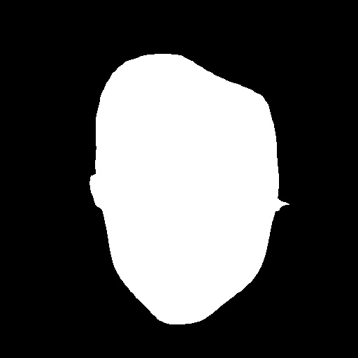

This is a pipeline for generating facial segmentation masks, either in full color and highlighting distinct areas of the face, or full black and white (face vs non-facial region). Only these two types of masks supported so far.

The face parsing model for facial feature segmentation is based on [BiSeNet: Bilateral Segmentation Network for Real-time Semantic Segmentation](https://arxiv.org/abs/1808.00897). This project is built upon the following repo: [GitHub Repository](https://github.com/yakhyo/face-parsing). Please check the original source for more information, citation, ... .

## Installation

```commandline
pip install -r requirements.
sh download.sh
```

## Usage

```
usage: inference.py [-h] [--model MODEL] [--weight WEIGHT] [--input INPUT] [--output OUTPUT] [--masktype MASKTYPE]

options:
  -h, --help       show this help message and exit
  --model MODEL    model name, i.e resnet18, resnet34
  --weight WEIGHT  path to trained model, i.e resnet18/34
  --input INPUT    path to an image or a folder of images
  --output OUTPUT  path to save model outputs
  --masktype MASKTYPE type of generated mask (bw = black and white, color = full color)

```

<table>
  <tr>
    <td style="text-align: left;"><p>Input Images</p></td>
    <td style="text-align: center;"></td>
  </tr>
  <tr>
    <td style="text-align: left;"><p>ResNet34</p></td>
    <td style="text-align: center;"></td>
  </tr>
  <tr>
    <td style="text-align: left;"><p>ResNet18</p></td>
    <td style="text-align: center;"></td>

  </tr>
</table>

